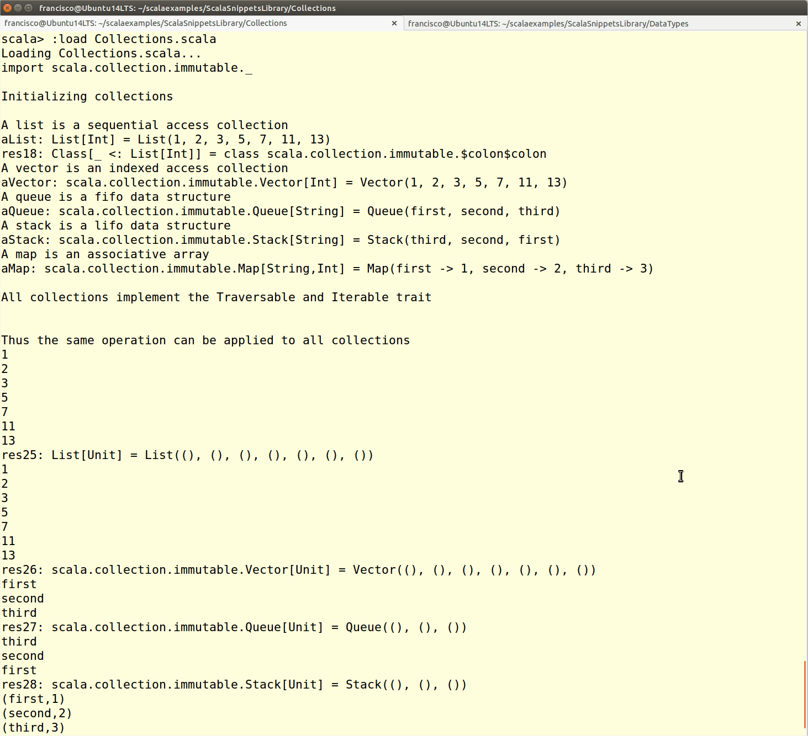

Collections in Scala
==============================
This script shows how to define variables containing different types of collections

Scala provides programmers with the usual collection types, such as vectors, lists, queues, stacks and maps. Almost all of them come into two flavors: mutable and immutable, linked to the namespaces `scala.collection.mutable` and `scala.collection.immutable` respectively.

Although each collection type has its own peculiarities, all of them implement the common traits `Traversable` and `Iterable`. Therefore, they can also be used as homogeneous collections, as shown in this script. Moreover, it is possible to transform collections from one type to another, for instance obtaining a list from a vector or an array from a stack.

How to use the snippet
----------------------

Run the snippet using the following syntax: `scala Collections.scala`. 

The following image shows the output produced by the snippet.

.
