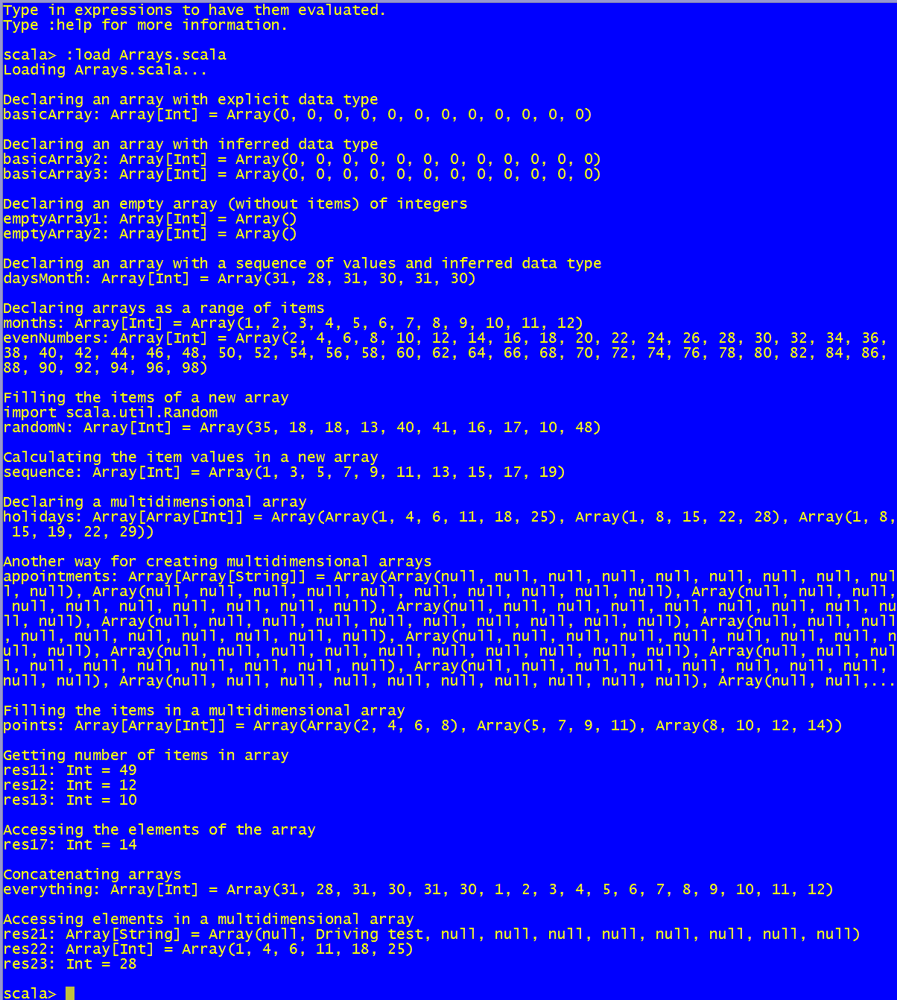

Declaration and use of arrays
==============================
This script shows how to define variables containing arrays of items

How to use the snippet
----------------------

Run the snippet using the following syntax: `scala Arrays.scala`. 

The following image shows the output produced by the snippet.

.
