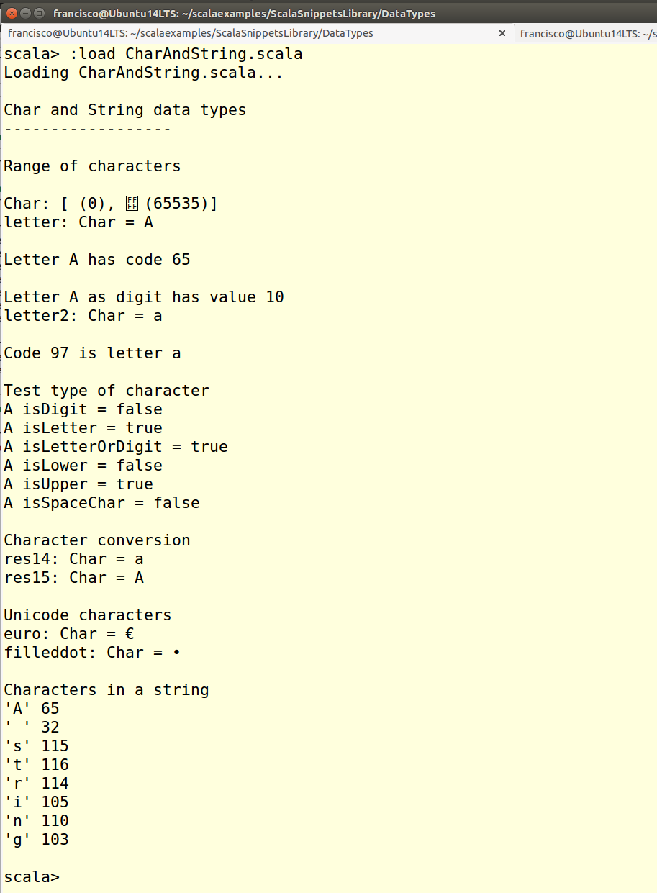

Char and String Data Types
==============================
This script shows how to use the Char and String data types

Characters and strings of characters in Scala
---------------------------------------------
Scala has a `Char` data type, to work with individual character, and a `String` data type, able to hold sequences of characters.

`Char` and `String` are Unicode, so all the letters and symbols from many alphabets can be used. The code from any character can be obtained through methods such as `toInt`. In the same way, any integer number in the range `Char.MinValue` to `Char.MaxValue` can be converted to the corresponding character using the `toChar` method.

The content of a `Char` can be classified by means of the `isXXX` methods: `isControl`, `isLetter`, `isDigit`, `isLetterOrDigit`, `isLower`, `isUpper` e `isSpaceChar`. There are some conversion methods available, being the most common ones `toLower` and `toUpper`.
  
How to use the snippet
----------------------

Run the snippet using the following syntax: `scala CharAndString.scala`. 

The following image shows the output produced by the snippet.

.
