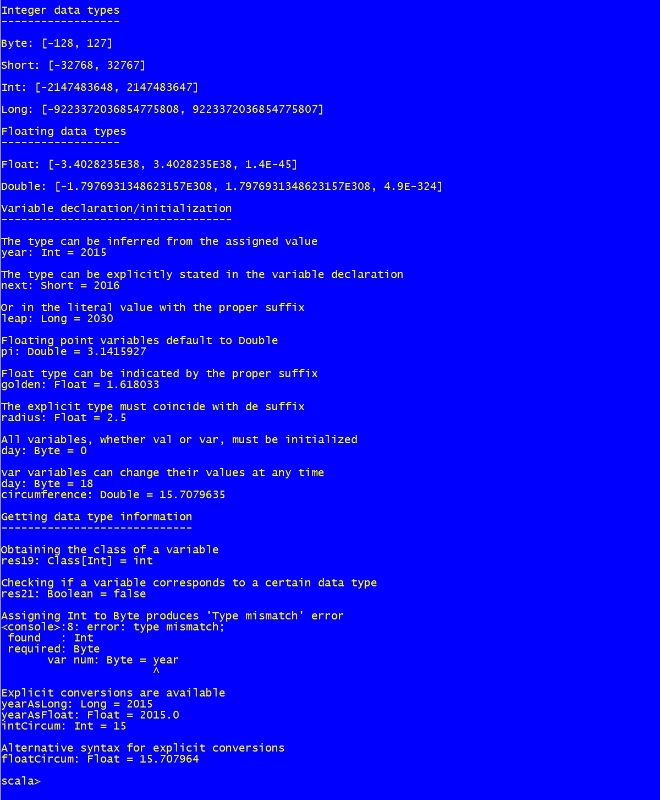

Numeric Data Types
==============================
This script shows how to declare variables and use different numeric data types

Numeric data types in Scala
---------------------------

As many other programming languages, Scala has integer and floating point data types. There are four integer types:

* `Byte`: 8 bits signed integer
* `Short`: 16 bits signed integer
* `Int`: 32 bits signed integer
* `Long`: 64 bits signed integer
    
Moreover, there are two floating point numeric types:

* `Float`: Simple precision floating point
* `Double`: Double precision floating point
    
Unlike most programming languages, Scala treat numeric data types as objects. So, numeric variables and even numeric literals have methods. Some of them:

* `MinValue`: Returns the minimum value the type can hold
* `MaxValue`: Returns the maximum value the type can hold
* `MinPositiveValue`: Floating point types have this method, which returns the minimum positive value
* `toByte`, `toShort`, `toInt`, `toLong`, `toFloat`, `toDouble`: Explicit conversion methods
* `isInstanceOf[type]`: Checks if the value is of the specified type
* `asInstanceOf[type]`: Explicit conversion method
    
As usual in Scala, the type of a variable can be explicitly stated or it can be inferred from the literal value being assigned. Type of numeric literals can be indicated by a suffix such as `l`, for `Long` integer, or `f`, for `Float` floating point values.

Scala is a strongly typed language. As a consequence, certain assignments, such as assigning an `Int` value to a `Byte` variable, are not allowed and generate the corresponding error.

Scala integer literals can be given as hexadecimal numbers, following the syntax `0xABCD`. To use other numbering systems, such as binary, the `parseInt()` method (see source file) can be used. Numbers can be converted to hexadecimal and binary strings using the `toHexString` and `toBinaryString` of the integer data types.

How to use the snippet
----------------------

Run the snippet using the following syntax: `scala NumericDataTypes.scala`. 

The following image shows the output produced by the snippet.

.
