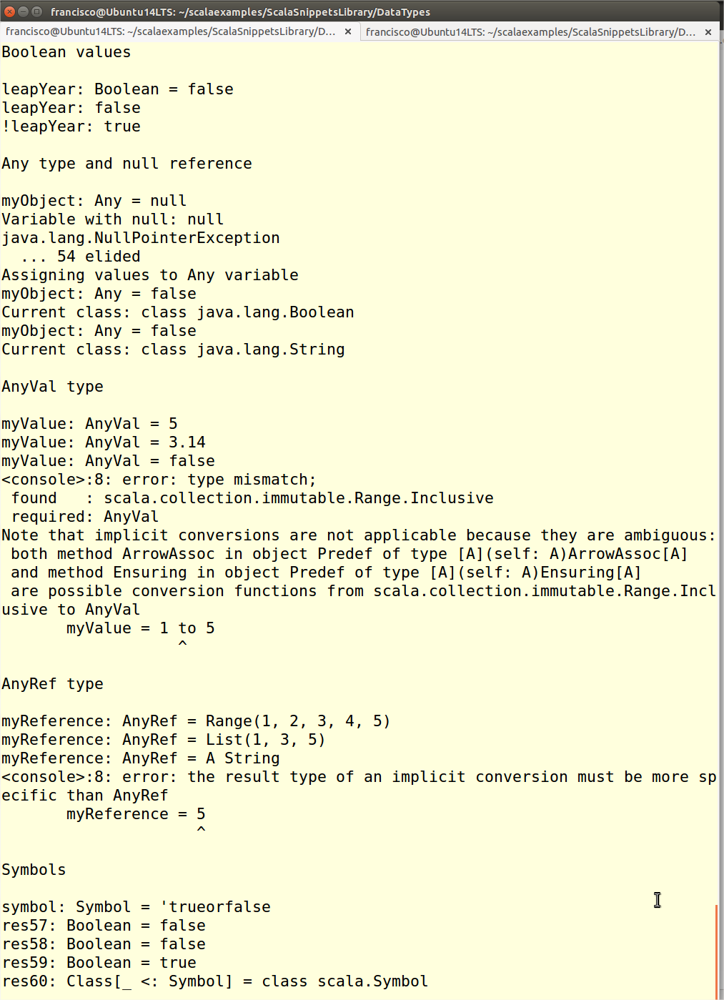

Working with other simple data types
==============================
This script shows how to use other simple data types in Scala, aside from numeric types, characters and character strings

Boolean
---------------------------------------------
Any variable (or `val`) initialized with the `true` or `false` values will be of `Boolean` type. This can be explicitly stated, for example while defining a new method. The result returned from relational expressions is also a `Boolean` value.

A `Boolean` value or variable can be used in any conditional. The `!` (not) operator negates a `Boolean` value.

Any, AnyVal and AnyRef
-------------
All Scala data types are objects, an all of them have the `Any` type as ancestor. Therefore, a `Any` variable can contain any value, and its class will change according to its content. The `null` value can be used to empty an `Any` variable.

Two different data types, `AnyVal` and `AnyRef` descend from `Any`. The former is the parent of all simple data types, such as numbers, `Boolean` and `Character`. The latter is the ancestor of the remainder data types, including character strings, arrays, vectors, etc.

Symbols
---------------
Symbols are a data type that Scala take from functional languages. A symbol is defined as any character string beginning with the `'` character, as shown in the snippet. Wherever the `'mysimbol` symbol appears it will be referencing exactly the same object.

How to use the snippet
----------------------

Run the snippet using the following syntax: `scala OtherSimpleDataTypes.scala`. 

The following image shows the output produced by the snippet.

.
