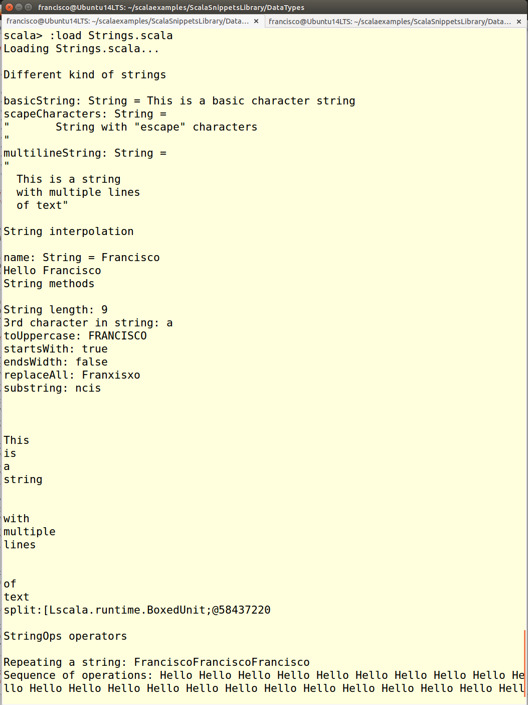

Working with the String data type
==============================
This script shows how to use the String data type and some of its methods

Different kind of strings
---------------------------------------------
The `String` data type of Scala is the same `String` type of Java, but *on the fly* conversions are made to other Scala classes which add some functionality to the basic `String`. String literals are delimited by `"` characters.

Scala strings can contain scapep characters, just as in Java. For instance, to include the `"` character inside a string literal you have to use `\"`. Moreover, a string literal can contain several lines of text as long as they are delimited with three `"` characters at the beginning and three more at the end.

It is possible to include variable values in a string literal by means of string interpolation, as shown in this snippet.

Besides Java `String` methods, such as `toUpperCase`, `startsWith`, `substring`, `split`, etc., Scala strings (thanks to the `StringOps` class) also support some operators and additional methods.

Also in this snippet, it is shown how a variable can contain XML data. The type of these variable is not `String` but it can be easily converted to `String` using their `text` method.

How to use the snippet
----------------------

Run the snippet using the following syntax: `scala Strings.scala`. 

The following image shows the output produced by the snippet.

.
