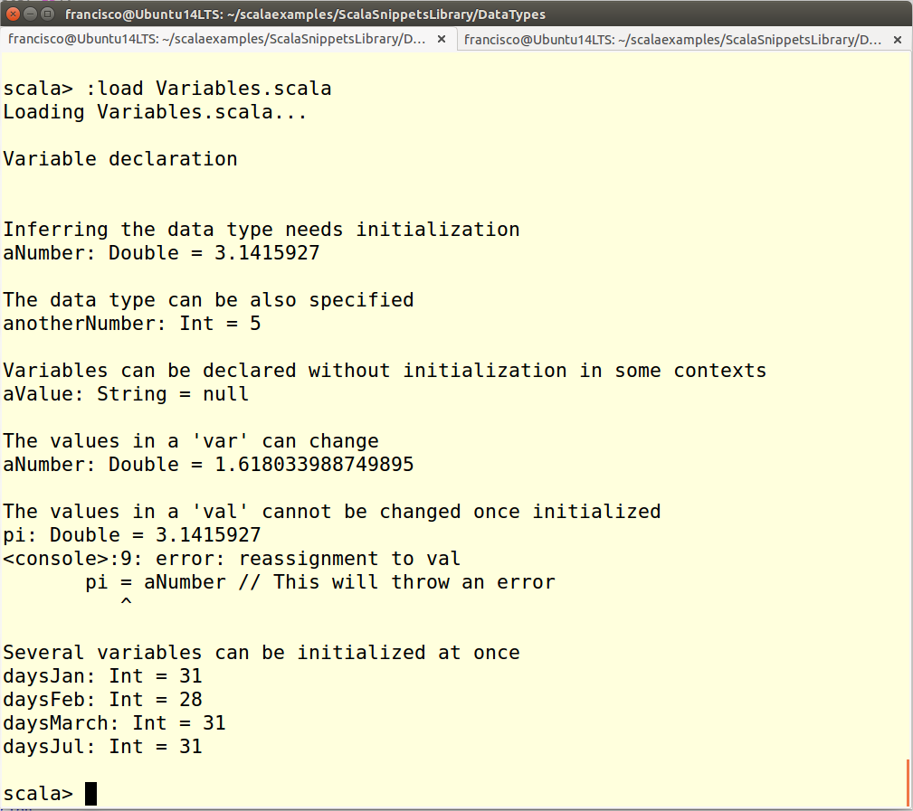

Declaring and initializing variables
==============================
This script shows how to declare and initialize variables in Scala

`var` vs `val` variables
---------------------------------------------
There two kinds of *variables* in Scala, those declared as `var` and the ones declared as `val`. The former is the usual variable kind in any language, while the latter acts in fact as a constant once it has been initialized.

The data type of a variable can be explicitly stated or it can be inferred from the value used to initialize the variable. The assignment of an initial value is compulsory in most scenarios. However, a variable can be declared specifiying its type and without an initial in some contexts, for instance inside a class definition.

Unlike `val` variables, the content of a `var` variable can be changed at any type, as long as the new value is compatible with the data type of the variable.

It is possible to initialize several variables with the same value during declaration, as shown in this snippet, as well as initialize pairs of variables with pairs of values.

How to use the snippet
----------------------

Run the snippet using the following syntax: `scala Variables.scala`. 

The following image shows the output produced by the snippet.

.
