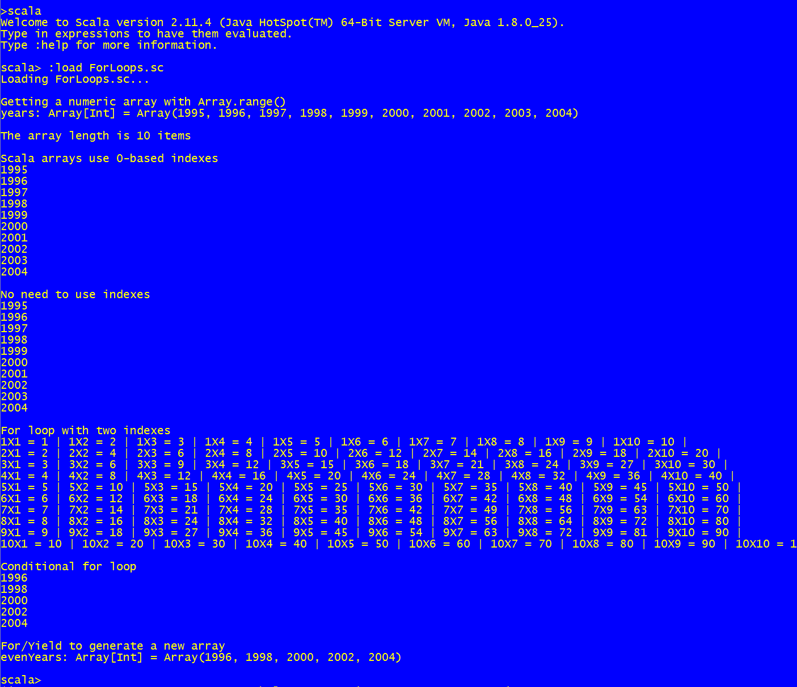

Using for loops
==============================
Script that shows different uses of the `for` loop

How to use the snippet
----------------------

Run the snippet using the following syntax: `scala ForLoops.scala`. 

The following image shows the output produced by the snippet.

.
