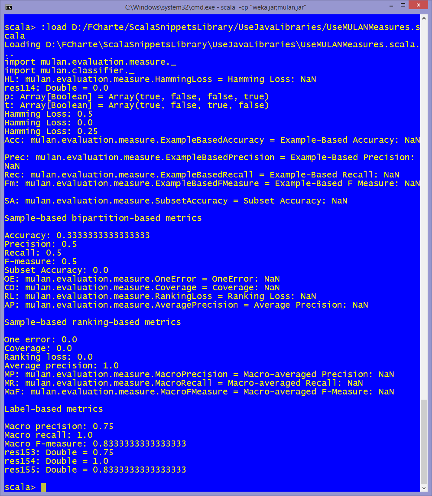

How to use MULAN measures classes
==============================
[MULAN](http://mulan.sourceforge.net/) is a Java library for machine learning with multilabel datasets. This snippet shows how to use the MULAN classess aimed to evaluate classification performance. The [UseMulan.scala](https://github.com/fcharte/ScalaSnippetsLibrary/blob/master/UseJavaLibraries/UseMULAN.scala) snippet shows how to work with MULAN.

How to use the snippet
----------------------
To run this snippet you will need the WEKA and MULAN libraries, two `.jar` files that are available at the [MULAN](http://mulan.sourceforge.net/) and [WEKA](http://www.cs.waikato.ac.nz/ml/weka/) websites.

Run the snippet using the following syntax: `scala -cp "weka.jar;mulan.jar" UseMULANMeasures.scala`. 

The following image shows the output produced by the snippet, showing the evaluation results for some fake date:

.
